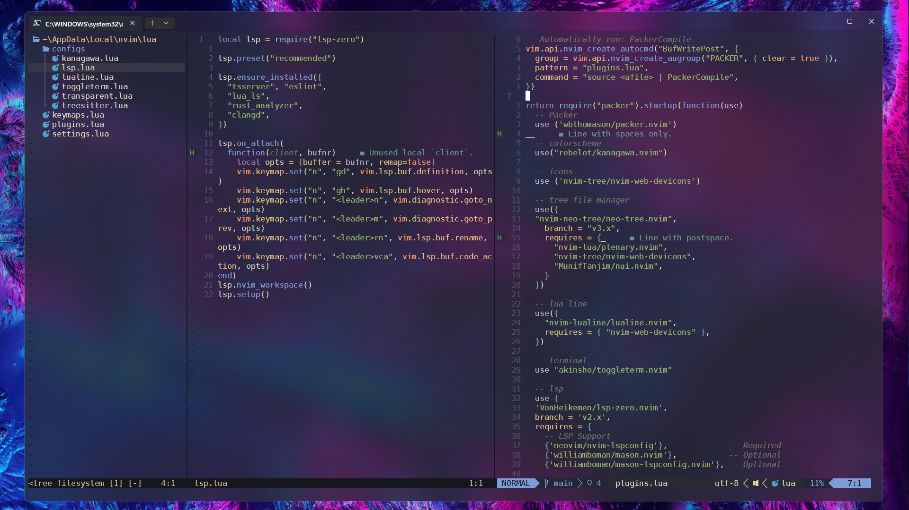
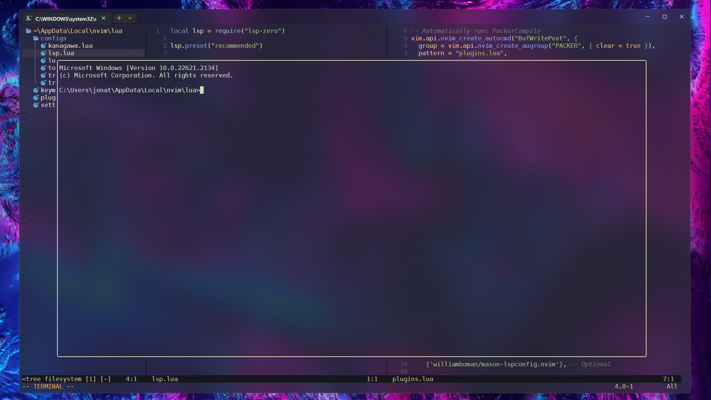

# jtnvv dotfiles🦨

***
Mi implementación de NeoVim especificado para mi flujo de trabajo, autocompletado con LSP (LSP:zero) y si se deseea agregar algun otro lenguaje se posee de Mason para instalar mas lenguajes.
## Requerimientos🫠
- [Node](https://nodejs.org/en)
- [Packer](https://github.com/wbthomason/packer.nvim)
- [NerdFonts](https://www.nerdfonts.com/font-downloads)
- [Git](https://git-scm.com/downloads)
- [NeoVim](https://neovim.io/)
## Instalación🤺
Si deseas usar mi implementación de NeoVim sigue los siguientes pasos:
#### Windows:
1. Ir al directorio `...\Appdata\Local\`
2. Crear una carpeta llamada `nvim`
3. Dentro de la carpeta abrir una terminal
4. Clonar el repositorio:
```bash
git clone https://github.com/jtnvv/dotfiles.git
```
5. Entrar a nvim usando `nvim .` en la terminal
6. Ejecutar `:PackerSync` en el editor de nvim
#### Windows:
1. Ir al directorio `~/.config/nvim`
2. Crear una carpeta llamada `nvim`
3. Dentro de la carpeta abrir una terminal
4. Clonar el repositorio:
```bash
git clone https://github.com/jtnvv/dotfiles.git
```
5. Entrar a nvim usando `nvim .` en la terminal
6. Ejecutar `:PackerSync` en el editor de nvim
## Plugins usados🤠
#### Manager de paquetes/plugins:
- [Packer:](https://github.com/wbthomason/packer.nvim)
#### Aspecto:
- [kanagawa scheme](https://github.com/rebelot/kanagawa.nvim)
- [Dev icons](https://github.com/nvim-tree/nvim-web-devicons)
- [Lua Line](https://github.com/nvim-lualine/lualine.nvim)
- [Tree-Sitter](https://github.com/nvim-treesitter/nvim-treesitter)
- [Transparent:](https://github.com/xiyaowong/transparent.nvim) Una vez instalado y configurado colocar `:TransparentEnable` en el modo comando
#### Arbol de archivos:
- [Neo-Tree:](https://github.com/nvim-neo-tree/neo-tree.nvim) La tecla configurada para abrir el arbol de archivos es `F5`
#### Autocompletado:
- [LSP-Zero: ](https://github.com/VonHeikemen/lsp-zero.nvim) Este plugin trae incluido los mas usados para el manejo de LSP, es decir: Mason, cmp, luaSnip y LSPconfig (La tecla predefinida para el autocompletado es `Control + y`, si se desea se puede cambiar creando un archivo de configuración, o dentro del propio archivo del plugin)
#### Terminal:
- [Toggleterm:](https://github.com/akinsho/toggleterm.nvim) La tecla configurada para abrir/cerrar la terminal es `F7`, en este caso esta configurado para generar la terminal en la mitad de la pantalla.

